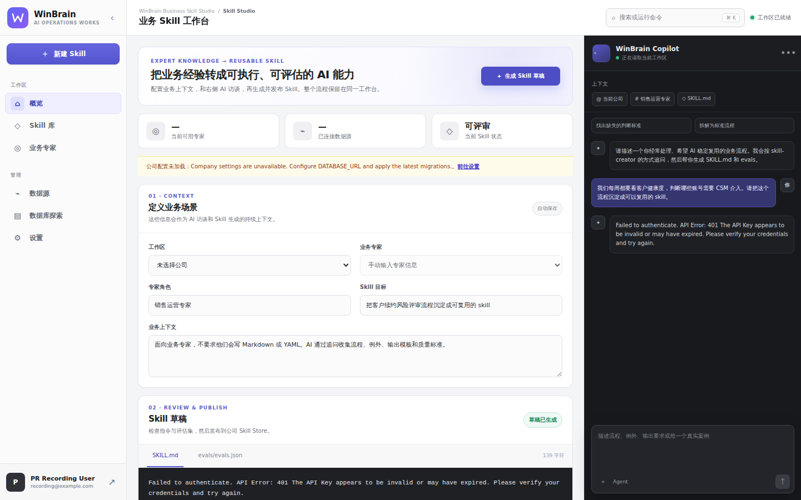

# WinBrain

WinBrain 是一个面向企业业务专家的 **AI Operations Workspace**。当前主应用 Business Skill Studio 将专家访谈、业务上下文、Kimi Code、版本化 Skill Store、客户数据源和数据库探索整合到同一个 SaaS 工作台中，帮助团队把重复性的业务经验沉淀为可维护、可追踪、可复用的 Agent Skill。

> 当前主干已经包含 SaaS 工作台、AI Copilot、组织作用域 Skill 库、Kimi Code 接入、PostgreSQL 版本存储、MySQL/OceanBase 数据源管理、数据库元数据探索，以及自动截图和录屏验证。

## 当前界面



[查看最近一次已合并的 Business Skill Studio 原始录屏](pr-evidence/pr-36/business-skill-studio/latest/video/5816cdb16c2b54c9ccf8a1a74cda8ba4.webm)

## 核心能力

| 能力 | 当前实现 |
| --- | --- |
| AI 工作台 | 三栏 SaaS 工作台：主导航、Skill 编辑区和持续可见的 AI Copilot |
| 专家访谈 | 根据专家角色、专业领域和业务背景进行流式对话 |
| Skill 生成 | 生成并编辑 `SKILL.md`、`evals/evals.json`、假设和待确认问题 |
| Kimi Code | 通过 Claude Agent SDK 调用 Kimi Coding 端点，支持主备 Key 故障转移 |
| Skill 库 | 按全局或公司作用域搜索、创建、导入、编辑、导出和删除 Skill |
| 版本管理 | 文件系统或 PostgreSQL 后端；每次保存生成不可变 revision |
| 公司与专家 | 管理组织、专家、部门、专长和工作上下文 |
| 客户数据源 | 加密保存 MySQL/OceanBase 连接信息并执行受控只读连接测试 |
| 数据库探索 | 浏览表、字段、索引、约束和 DDL，并使用元数据驱动的数据库分析 Agent |
| 可观测性 | 可选的 Claude Agent SDK 结构化耗时分析，覆盖 TTFT、结果、清理和故障转移 |
| 自动验收 | GitHub Actions 自动执行测试、构建、Playwright、截图、GIF 和原始 WebM 录屏 |

## 运行模式

WinBrain 明确区分以下三种运行状态：

1. **本地演示模式**：未配置 Kimi Key 时，聊天和 Skill 草稿使用确定性 fallback，便于查看 UI 和业务流程；这不代表真实模型链路已经验证。
2. **真实模型模式**：配置 `KIMI_API_KEY_PRIMARY` 后，通过 Claude Agent SDK 调用 Kimi Coding 端点。可选配置 fallback Key 进行凭据切换。
3. **真实栈验收模式**：CI 同时启动生产构建、真实模型调用、认证流程和 PostgreSQL，并验证 Skill 能通过 UI 保存后从数据库读回。这是判断“真正能跑”的最高级别证据。

## 技术栈

- **Web**：Next.js 15、React 19、TypeScript
- **认证**：Auth.js / NextAuth credentials
- **Agent**：`@anthropic-ai/claude-agent-sdk`
- **模型端点**：Kimi Coding Claude-compatible endpoint
- **应用数据库**：PostgreSQL、Prisma 7、`@prisma/adapter-pg`
- **客户数据源**：MySQL 8 / OceanBase MySQL mode
- **测试**：Node test runner、Playwright、GitHub Actions
- **Agent 资产**：仓库级 `.agents/`，并提供 `.codex/` 镜像

## 仓库结构

```text
WinBrain/
├── apps/business-skill-studio/   # Next.js 主应用
├── .agents/                      # Agent plugins、skills 和参考资产
├── .codex/                       # Codex 兼容镜像
├── tests/                        # 仓库级 Playwright 场景
├── tools/                        # 前端录制和验证工具
├── scripts/                      # PR evidence 渲染与自动化脚本
├── pr-evidence/                  # PR 截图、GIF、WebM 和验证摘要
└── .github/workflows/            # 构建、数据库、录屏和语言策略工作流
```

## 快速启动

### 1. 安装依赖

```bash
cd apps/business-skill-studio
npm ci
cp .env.example .env.local
```

### 2. 启动本地数据库

```bash
docker compose -f docker-compose.db.yml up -d
npm run db:migrate
```

该 Compose 配置同时提供：

- PostgreSQL：保存公司、专家、数据源配置和版本化 Skill；
- MySQL FMCG 测试库：用于验证客户数据源连接和只读元数据流程。

### 3. 配置认证

生成管理员密码哈希：

```bash
npm run auth:hash-password -- "replace_this_password"
```

在 `.env.local` 中设置：

```bash
AUTH_SECRET=replace_with_32_byte_random_secret
NEXTAUTH_URL=http://localhost:3000
AUTH_USER_EMAIL=admin@example.com
AUTH_USER_NAME="Studio Admin"
AUTH_USER_ROLE=admin
AUTH_USER_PASSWORD_HASH=replace_with_bcrypt_hash
```

### 4. 配置 Kimi Code

```bash
KIMI_API_KEY_PRIMARY=your_primary_kimi_api_key
KIMI_API_KEY_FALLBACK=your_fallback_kimi_api_key
KIMI_BASE_URL=https://api.kimi.com/coding/
KIMI_THINKING_TOKENS=32768
CLAUDE_CODE_AUTO_COMPACT_WINDOW=262144
AGENT_SDK_ATTEMPT_TIMEOUT_MS=600000
```

Kimi Coding 端点在开启 Thinking 后由上游路由到当前 K2.7 Code 能力。不要设置 `ANTHROPIC_MODEL=kimi-2.7-code`；该字符串不是此 Claude-compatible 端点使用的模型标识。

旧的 `ANTHROPIC_*` 变量仍作为迁移兼容别名，但新部署应优先使用 `KIMI_API_KEY_PRIMARY` 和 `KIMI_API_KEY_FALLBACK`。

### 5. 启动应用

```bash
npm run dev
```

打开 `http://localhost:3000`。登录后可访问：

- `/`：AI Operations Workspace 与 Skill 草稿工作台
- `/skills`：组织作用域专家 Skill 库
- `/database`：数据库元数据探索和分析 Agent
- `/settings`：公司、专家和客户数据源设置

## Skill Store

WinBrain 支持两种后端：

| Driver | 配置 | 适用场景 |
| --- | --- | --- |
| `filesystem` | `SKILL_STORE_DRIVER=filesystem` | 本地开发、单机演示 |
| `database` | `SKILL_STORE_DRIVER=database` | PostgreSQL 持久化、多组织和版本管理 |

文件系统模式按组织隔离：

```text
data/generated-skills/organizations/<organization-id>/<skill-slug>/
```

PostgreSQL 模式使用 `(scope_key, slug)` 作为作用域唯一键；编辑会追加不可变 revision，而不是覆盖历史版本。

## 客户数据库安全边界

客户数据库密码在服务端使用 AES-256-GCM 加密后写入 PostgreSQL。浏览器 API 不返回明文密码。

连接测试只执行受控只读操作，包括：

```sql
SELECT 1;
SELECT VERSION(), DATABASE(), @@character_set_connection;
SHOW GRANTS FOR CURRENT_USER;
SELECT ... FROM information_schema.TABLES;
SELECT ... FROM information_schema.COLUMNS;
```

生产环境默认阻止私有、回环、链路本地和保留地址。请为客户数据库创建仅具有 `SELECT` 和 `SHOW VIEW` 权限的专用账号。

## Agent SDK 耗时分析

通过以下变量开启结构化耗时日志：

```bash
AGENT_SDK_PROFILE_LOGGING=summary
```

支持：

- `off`：关闭；
- `summary`：每次凭据尝试和整个请求各输出一条汇总；
- `verbose`：额外输出 SDK 初始化、首消息、首文本和最终结果等里程碑。

日志不会记录 Prompt、模型正文、Thinking、凭据值或原始错误消息。详细说明见：

- `apps/business-skill-studio/docs/claude-agent-sdk-profiling.md`

## 验证

在应用目录执行：

```bash
npm run test:unit
npm run test:integration
npm run typecheck
npm run build
```

在仓库根目录执行 Playwright：

```bash
npm ci
npx playwright install --with-deps chromium
npm run test:e2e
```

常用浏览器场景包括：

- Business Skill Studio 登录、聊天和 Skill 草稿生成；
- Skill 库全局与组织作用域 CRUD；
- 数据库探索、搜索、DDL 和分析 Agent；
- 真实 Kimi LLM 调用；
- PostgreSQL Skill 保存与读回验证。

## PR 截图和录屏

每个面向 `main` 的 PR 会触发视觉证据工作流。工作流会：

1. 安装依赖并执行生产构建；
2. 启动真实 Business Skill Studio；
3. 使用 Playwright 登录并运行关键业务场景；
4. 生成截图、15 秒 GIF 预览和完整 WebM；
5. 将媒体提交到 `pr-evidence/pr-<编号>/.../latest/`；
6. 把最新证据直接写入 PR 正文。

判断一个版本是否“真正能跑”时，优先检查 **真实 LLM 与 PostgreSQL 视觉证据**，其次检查 Business Skill Studio 前端录屏；仅有静态页面截图不能证明模型和持久化链路可用。

## 安全要求

- 不要在代码、PR、Issue、截图、录屏或日志中粘贴真实 Kimi Key、数据库密码或生产认证信息。
- 任何曾在聊天、日志或截图中暴露的密钥都应立即撤销并重新生成。
- 生产环境应使用 Secret Manager 或部署平台的加密 Secret，而不是提交 `.env.local`。
- `DATA_SOURCE_ENCRYPTION_KEY`、`AUTH_SECRET` 和管理员密码哈希必须独立生成。

## 当前边界

当前已包含：

- 单管理员认证；
- 多公司、多专家和组织作用域 Skill；
- Kimi Code 流式聊天、Skill 草稿和主备凭据切换；
- PostgreSQL / 文件系统版本化 Skill Store；
- Skill 库完整 CRUD；
- MySQL/OceanBase 数据源安全配置与连接测试；
- 数据库元数据探索和只读分析 Agent；
- 自动化测试、真实栈验证和视觉证据。

尚未包含：

- 专家独立登录、邀请和细粒度组织角色；
- 生产 Secret Manager 适配器；
- 任意业务数据查询或自动执行写 SQL；
- Skill 打包发布和 eval 执行平台。

## 进一步文档

- `apps/business-skill-studio/README.md`：应用详细配置与实现说明
- `apps/business-skill-studio/docs/`：数据源安全、本地测试库和 Agent SDK profiling
- `AGENTS.md`：仓库 Agent、中文 PR 和视觉证据规范
